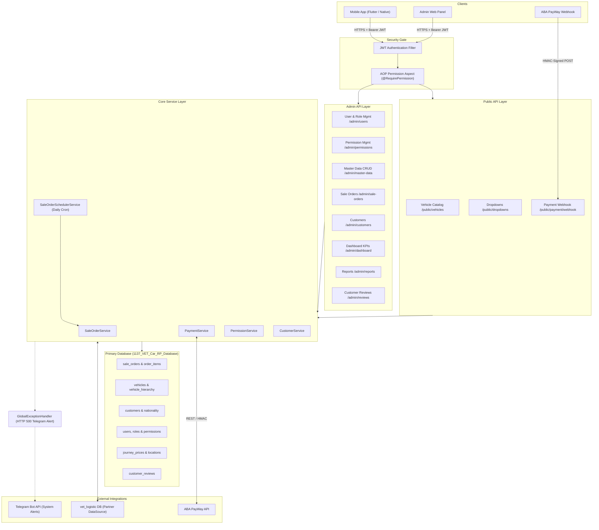

# 🚗 VET Car Rental API

> **A production-grade, full-stack Spring Boot REST API powering vehicle booking, inventory management, real-time payments, and multi-role administration for the VET Car Rental platform.**

---


---

## 📋 Table of Contents

- [Project Overview](#-project-overview)
- [System Architecture & Data Flow](#-system-architecture--data-flow)
- [Key Features & Modules](#-key-features--modules)
- [Tech Stack & Dependencies](#-tech-stack--dependencies)
- [Project Structure](#-project-structure)
- [Getting Started & Installation](#-getting-started--installation)
- [API Documentation](#-api-documentation)
- [Security & Error Handling](#-security--error-handling)
- [Database Strategy](#-database-strategy)
- [Background Schedulers](#-background-schedulers)

---

## 📌 Project Overview

The **VET Car Rental API** is the central backend service for VET's vehicle rental operations. It serves three distinct client surfaces:

- 📱 **Mobile App** (Flutter / Native) — customer-facing vehicle browsing, booking, and payment
- 🖥️ **Admin Web Panel** — fleet management, user/role/permission administration, reporting, and KPI dashboards
- 🔗 **ABA PayWay Webhook** — real-time payment confirmation callbacks from the ABA payment gateway

The system handles the complete lifecycle of a car rental transaction — from vehicle discovery and price calculation (based on journey type and location) through order creation, ABA PayWay-integrated payment processing, order status management, and post-rental customer reviews. All administrative operations are protected by a fine-grained, AOP-driven permission system layered on top of JWT authentication.

---

## 🏗️ System Architecture & Data Flow



---

## ✨ Key Features & Modules

### 🌐 Public APIs (Unauthenticated)

| Endpoint Group | Description |
|---|---|
| `GET /public/vehicles/**` | Browse vehicle catalog with category, brand, model, and facility filters |
| `GET /public/dropdowns/**` | Provinces, sub-locations, rental types, nationalities for app forms |
| `POST /public/payment/webhook` | ABA PayWay callback endpoint for asynchronous payment confirmation |

---

### 🔒 Admin Panel APIs (JWT + Permission-Gated)

#### 👥 User, Role & Permission Management
- Full CRUD for **Admin Users** with role assignment
- Fine-grained **Permission** definitions with module/action scoping
- **Role** creation with bundled permission sets

#### 📦 Master Data Management (14 Entities)

| Module | Description |
|---|---|
| `vehicle_brand` | Car manufacturer brands |
| `vehicle_category` | Vehicle category classification |
| `vehicle_model` | Model records linked to brand/category |
| `vehicle` | Individual rentable vehicle inventory |
| `vehicle_rental_type` | Rental type definitions (daily, hourly, etc.) |
| `facility` | Vehicle amenities and features |
| `journey_price` | Price matrix by journey type & location |
| `province` | Province/region master data |
| `sub_location` | Sub-location / pickup-dropoff points |
| `nationality` | Customer nationality reference data |
| `customer` | Customer profile management |
| `customer_support` | Support request management |
| `privacy_term` | Privacy policy content management |
| `about_us` | Platform about/info content management |

#### 🧾 Sale Orders
- Full sale order lifecycle: **Draft → Confirmed → Paid → Completed → Cancelled**
- Order item breakdown per vehicle
- Integration with `PaymentService` for ABA PayWay charge initiation
- Admin override and manual status management

#### 📊 Dashboard & Reports
- Real-time KPI dashboard (total orders, revenue, active customers)
- Report generation with filterable date ranges and export capability

#### ⭐ Customer Reviews
- Review moderation, rating aggregation, and response management

---

### 📱 Mobile Booking APIs (JWT-Authenticated)

| Feature | Description |
|---|---|
| Vehicle Search & Filter | Browse fleet by category, location, availability |
| Booking Creation | Create sale orders with journey price calculation |
| ABA PayWay Checkout | Initiate payment and receive redirect URLs |
| Order History | Customer's personal booking history |
| Profile & Reviews | Manage customer profile and submit reviews |

---

### ⏰ Background Schedulers

| Scheduler | Schedule | Responsibility |
|---|---|---|
| `SaleOrderSchedulerService` | Daily (Cron) | Auto-expire pending/unpaid orders past the confirmation window; generate daily reconciliation snapshots |

---

## 🛠️ Tech Stack & Dependencies

### Core Framework

| Technology | Version | Purpose |
|---|---|---|
| **Java** | 17 (LTS) | Primary language |
| **Spring Boot** | 3.3.3 | Application framework |
| **Spring MVC** | managed | REST controller layer |
| **Spring Security** | managed | Authentication & Authorization |
| **Spring AOP** | managed | Permission aspect enforcement |
| **Spring Cache** | managed | Caffeine-backed in-memory caching |
| **Spring Actuator** | managed | Health checks & metrics exposure |
| **Spring Session JDBC** | managed | Persistent session management |

### Data Layer

| Technology | Version | Purpose |
|---|---|---|
| **MySQL** | 8.0+ | Primary relational database |
| **jOOQ** | 3.19.18 | Type-safe SQL query builder |
| **Flyway** | managed | Database schema versioning & migrations |
| **HikariCP** | managed | High-performance JDBC connection pooling |
| **Spring Data Commons** | managed | Pagination and repository abstractions |

### Security & Tokens

| Technology | Version | Purpose |
|---|---|---|
| **JJWT (io.jsonwebtoken)** | 0.12.6 | JWT creation, parsing, and validation |

### Resilience & Reliability

| Technology | Version | Purpose |
|---|---|---|
| **Resilience4j** | 2.4.0 | Circuit breaker for external API calls (ABA PayWay) |
| **Caffeine Cache** | managed | Fast in-memory L1 cache for master data |

### Code Quality & Productivity

| Technology | Version | Purpose |
|---|---|---|
| **Lombok** | 1.18.34 | Boilerplate reduction (`@Builder`, `@Data`, etc.) |
| **MapStruct** | 1.6.3 | Compile-time DTO to entity mapping |
| **Apache Commons Lang3** | managed | String and object utility methods |
| **Thumbnailator** | 0.4.20 | Server-side image resizing for file uploads |

### API Documentation

| Technology | Version | Purpose |
|---|---|---|
| **SpringDoc OpenAPI** | 2.6.0 | Auto-generated Swagger UI & OpenAPI 3 spec |

### External Integrations

| Integration | Purpose |
|---|---|
| **ABA PayWay API** | Payment initiation, status query, and webhook verification for Cambodian payments |
| **Telegram Bot API** | Real-time system alert delivery on unhandled 500 errors via `GlobalExceptionHandler` |
| **vet_logistic DB** | Partner secondary datasource accessed via a dedicated `PartnerDataSourceConfig` |

---

## 📁 Project Structure

```
Car_Rental_API/
├── src/
│   ├── main/
│   │   ├── java/com/Car_Rental_API/
│   │   │   │
│   │   │   ├── CarRentalApiApplication.java          # Spring Boot entry point
│   │   │   │
│   │   │   ├── common/                               # Shared cross-cutting concerns
│   │   │   │   ├── base/                             # BaseEntity, BaseRepository abstractions
│   │   │   │   ├── base_dto/                         # Shared DTOs (ApiResponse, PageResponse)
│   │   │   │   ├── config/
│   │   │   │   │   ├── AppConfig.java                # Bean configurations (RestTemplate, etc.)
│   │   │   │   │   ├── DataSourceConfig.java         # Primary HikariCP DataSource config
│   │   │   │   │   └── PartnerDataSourceConfig.java  # Secondary DataSource (vet_logistic DB)
│   │   │   │   ├── exception/
│   │   │   │   │   ├── GlobalException.java          # Custom base exception
│   │   │   │   │   ├── GlobalExceptionHandler.java   # @ControllerAdvice + Telegram alerting
│   │   │   │   │   └── ResourceNotFoundException.java
│   │   │   │   └── util/
│   │   │   │       ├── QueryUtil.java                # jOOQ query builder helpers
│   │   │   │       └── TelegramUtil.java             # Telegram Bot API integration
│   │   │   │
│   │   │   ├── security/
│   │   │   │   ├── authentication/
│   │   │   │   │   ├── auth/                         # Login, token refresh endpoints
│   │   │   │   │   ├── config/                       # SecurityFilterChain, CORS, CSRF config
│   │   │   │   │   ├── filter/
│   │   │   │   │   │   └── JwtAuthenticationFilter.java
│   │   │   │   │   ├── user/                         # UserDetails, UserRepository
│   │   │   │   │   └── util/                         # JwtUtil (sign, verify, extract claims)
│   │   │   │   └── authorization/
│   │   │   │       ├── permission/                   # Permission model, service, controller
│   │   │   │       │   ├── controller/
│   │   │   │       │   ├── dto/
│   │   │   │       │   ├── mapper/
│   │   │   │       │   ├── model/
│   │   │   │       │   ├── repository/
│   │   │   │       │   └── service/
│   │   │   │       ├── role/                         # Role model, service, controller
│   │   │   │       └── util/                         # AOP @RequirePermission aspect
│   │   │   │
│   │   │   └── module/                               # Feature modules (vertical slices)
│   │   │       ├── master_data/
│   │   │       │   ├── about_us/                     # controller / dto / mapper / model / repo / service
│   │   │       │   ├── customer/
│   │   │       │   ├── customer_support/
│   │   │       │   ├── facility/
│   │   │       │   ├── journey_price/
│   │   │       │   ├── nationality/
│   │   │       │   ├── privacy_term/
│   │   │       │   ├── province/
│   │   │       │   ├── sub_location/
│   │   │       │   ├── vechicle/
│   │   │       │   ├── vehicle_brand/
│   │   │       │   ├── vehicle_category/
│   │   │       │   ├── vehicle_model/
│   │   │       │   └── vehicle_rental_type/
│   │   │       ├── mobile/
│   │   │       │   └── dto/                          # Mobile-specific request/response DTOs
│   │   │       ├── payment/                          # ABA PayWay integration service
│   │   │       ├── report/                           # Report generation
│   │   │       ├── sale_order/                       # Sale order lifecycle management
│   │   │       └── file/                             # File upload & image processing
│   │   │
│   │   └── resources/
│   │       ├── application.yaml                      # Main configuration (env-variable driven)
│   │       ├── db/
│   │       │   └── migration/                        # Flyway versioned SQL scripts (V1__, V2__, ...)
│   │       ├── static/
│   │       └── templates/
│   │
│   └── test/
│       └── java/com/Car_Rental_API/                  # Unit & integration tests
│
├── .env                                              # Local environment overrides (git-ignored)
├── .gitignore
├── pom.xml                                           # Maven build descriptor
└── README.md
```

---

## 🚀 Getting Started & Installation

### Prerequisites

| Requirement | Minimum Version | Notes |
|---|---|---|
| **Java JDK** | 17 (LTS) | Verify with `java -version` |
| **Apache Maven** | 3.9+ | Or use the included `./mvnw` wrapper |
| **MySQL Server** | 8.0+ | Primary database must be accessible |
| **Git** | Any recent | To clone the repository |

---

### 1. Clone the Repository

```bash
git clone https://github.com/your-org/car-rental-api.git
cd car-rental-api
```

---

### 2. Configure Environment Variables

Copy `.env.example` to `.env` (loaded automatically via `spring.config.import`):

```bash
cp .env.example .env
```

Edit `.env` with your local values:

```properties
# ── APPLICATION ──────────────────────────────────────────────────
APP_ENV=dev
SERVER_PORT=8080

# ── PRIMARY DATABASE  (1137_VET_Car_RP_Database) ─────────────────
DB_URL=jdbc:mysql://localhost:3306/1137_VET_Car_RP_Database?useSSL=false&serverTimezone=UTC&allowPublicKeyRetrieval=true
DB_USERNAME=your_db_user
DB_PASSWORD=your_db_password

# ── PARTNER DATABASE  (vet_logistic DB) ──────────────────────────
PARTNER_DB_URL=jdbc:mysql://localhost:3306/vet_logistic?useSSL=false&serverTimezone=UTC
PARTNER_DB_USERNAME=your_partner_db_user
PARTNER_DB_PASSWORD=your_partner_db_password

# ── JWT AUTHENTICATION ───────────────────────────────────────────
# Use a strong (>=256-bit) random secret in production
JWT_SECRET=replace_with_a_256bit_or_longer_base64_encoded_random_secret
JWT_EXPIRATION=86400000          # Access token TTL  — 24 hours (ms)
JWT_REFRESH_EXPIRATION=604800000 # Refresh token TTL — 7 days  (ms)

# ── ABA PAYWAY  (Payment Gateway) ────────────────────────────────
ABA_API_URL=https://checkout.payway.com.kh/api/payment-gateway/v1/payments/purchase
ABA_MERCHANT_ID=your_aba_merchant_id
ABA_API_KEY=your_aba_api_key

# ── TELEGRAM BOT  (500-Error Alerting) ───────────────────────────
TELEGRAM_BOT_TOKEN=your_telegram_bot_token
TELEGRAM_CHAT_ID=your_telegram_chat_id
TELEGRAM_ENABLED=true
```

> **⚠️ Security Warning:** Never commit `.env` to version control. It is already excluded via `.gitignore`.

---

### 3. Database Setup

The application uses **Flyway** for database migration. Create the primary database first:

```sql
CREATE DATABASE `1137_VET_Car_RP_Database`
  CHARACTER SET utf8mb4
  COLLATE utf8mb4_unicode_ci;
```

Flyway will automatically apply all versioned scripts from `src/main/resources/db/migration/` on first startup.

---

### 4. Build the Application

```bash
# Using the Maven wrapper (recommended)
./mvnw clean package -DskipTests

# Or using a locally installed Maven
mvn clean package -DskipTests
```

---

### 5. Run Locally

```bash
# Via Maven Spring Boot plugin
./mvnw spring-boot:run

# Or via the packaged JAR
java -jar target/Car_Rental_API-0.0.1-SNAPSHOT.jar
```

The API will be available at: **`http://localhost:8080`**

---

### 6. (Optional) Regenerate jOOQ Classes

jOOQ code generation is **disabled by default** (`jooq.codegen.skip=true`). To regenerate from the live schema:

```bash
./mvnw generate-sources \
  -Djooq.codegen.skip=false \
  -Djooq.codegen.jdbc.url="jdbc:mysql://localhost:3306/1137_VET_Car_RP_Database" \
  -Djooq.codegen.jdbc.user=your_db_user \
  -Djooq.codegen.jdbc.password=your_db_password
```

Generated classes are output to `src/main/java/com/db_access/jooq/`.

---

## 📖 API Documentation

| Interface | URL |
|---|---|
| **Swagger UI** | `http://localhost:8080/swagger-ui.html` |
| **OpenAPI JSON Spec** | `http://localhost:8080/v3/api-docs` |
| **Actuator Health** | `http://localhost:8080/actuator/health` |

> Swagger UI requires a valid **Bearer JWT token** for all protected endpoints. Use the **Authorize** button in the Swagger UI to inject your token.

---

## 🔐 Security & Error Handling

### JWT Authentication Flow

```
Client Request
    │
    ▼
JwtAuthenticationFilter.java
    ├── Extracts Bearer token from Authorization header
    ├── Validates signature, expiry, and subject via JwtUtil
    ├── Loads UserDetails from UserRepository
    └── Sets UsernamePasswordAuthenticationToken in SecurityContextHolder
    │
    ▼
SecurityFilterChain
    ├── Public routes (/public/**, /swagger-ui/**, /v3/api-docs/**) → PERMIT_ALL
    └── All other routes → AUTHENTICATED
```

### AOP Permission Enforcement

Administrative endpoints are annotated with a custom `@RequirePermission` annotation. A Spring AOP aspect intercepts these method calls **before** execution, resolves the authenticated user's permissions, and throws `AccessDeniedException` if the required permission is absent — without polluting controller or service logic.

```java
// Example usage on an admin service method
@RequirePermission("SALE_ORDER:READ")
public Page<SaleOrderResponse> getAllOrders(Pageable pageable) { ... }
```

### Global Exception Handler & Telegram Alerting

`GlobalExceptionHandler.java` (`@RestControllerAdvice`) handles all exceptions uniformly:

| Exception Type | HTTP Status | Telegram Alert |
|---|---|---|
| `ResourceNotFoundException` | `404 Not Found` | No |
| `GlobalException` | `4xx` (contextual) | No |
| `MethodArgumentNotValidException` | `400 Bad Request` | No |
| `AccessDeniedException` | `403 Forbidden` | No |
| `Exception` (uncaught) | `500 Internal Server Error` | **Yes** |

On any unhandled `500` error, `TelegramUtil` fires an alert to the configured Telegram Bot chat including exception class, message, request URI, and a truncated stack trace — enabling instant production incident awareness.

### Resilience4j Circuit Breaker

External calls to the **ABA PayWay API** are wrapped with a Resilience4j circuit breaker:

```yaml
resilience4j:
  circuitbreaker:
    configs:
      default:
        slidingWindowSize: 10
        failureRateThreshold: 50    # Opens after 50% failure rate
        waitDurationInOpenState: 5s # Half-opens after 5 seconds
```

This prevents payment gateway outages from cascading into order management failures.

---

## 🗄️ Database Strategy

### Dual DataSource Architecture

| DataSource | Database | Configuration Class | Purpose |
|---|---|---|---|
| **Primary** | `1137_VET_Car_RP_Database` | `DataSourceConfig.java` | All core application data |
| **Partner** | `vet_logistic` | `PartnerDataSourceConfig.java` | External partner logistics data |

### Schema Migration (Flyway)

All DDL is version-controlled under `src/main/resources/db/migration/` using Flyway's naming convention:

```
V1__create_users_and_roles.sql
V2__create_vehicle_tables.sql
V3__create_sale_order_tables.sql
...
```

### Caching Strategy (Caffeine)

Frequently read master-data (vehicle catalog, nationalities, provinces, dropdowns) is cached with **Caffeine** (30-minute TTL, 200-entry max) to significantly reduce database round-trips.

---

## ⏰ Background Schedulers

The `SaleOrderSchedulerService` runs on a configurable daily cron schedule and handles:

1. **Auto-expiry** — Cancels pending orders that exceeded the payment confirmation window
2. **Reconciliation** — Generates daily order-status snapshots for reporting consistency

---

## 🤝 Contributing

1. Fork the repository
2. Create a feature branch: `git checkout -b feature/your-feature-name`
3. Commit your changes following [Conventional Commits](https://www.conventionalcommits.org/)
4. Open a Pull Request against `main` with a clear description

---

## 📄 License

Distributed under the **Apache License, Version 2.0**. See [LICENSE](https://www.apache.org/licenses/LICENSE-2.0.txt) for details.

---

<div align="center">

**Built with ❤️ by the VET Engineering Team**

*Spring Boot 3.3.3 · Java 17 · jOOQ · Flyway · ABA PayWay · Telegram*

</div>
